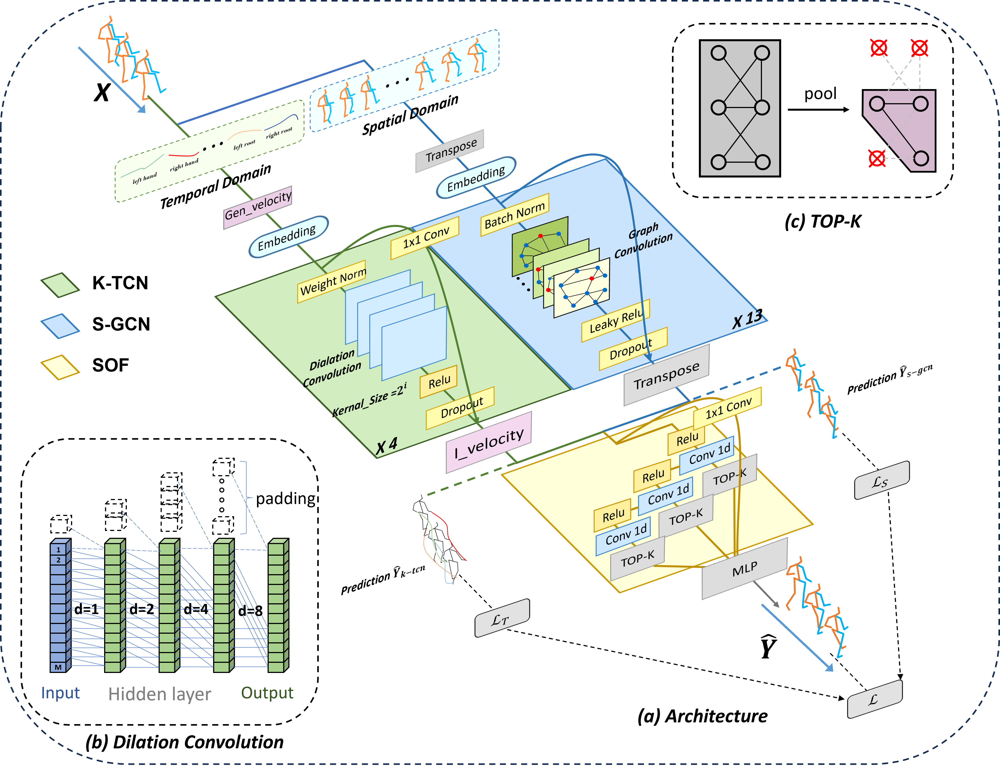

  <h1>KSOF:Leveraging Kinematics and Spatio-temporal Optimal Fusion for Human Motion Prediction</h1>

In this paper, we advocate explicitly describing kinematics information via velocity and acceleration by proposing a novel loss called joint point smoothness (JPS) loss, which calculates the acceleration of joints to smooth the sudden change in joint velocity.

  <h2>Network Architecture</h2>

